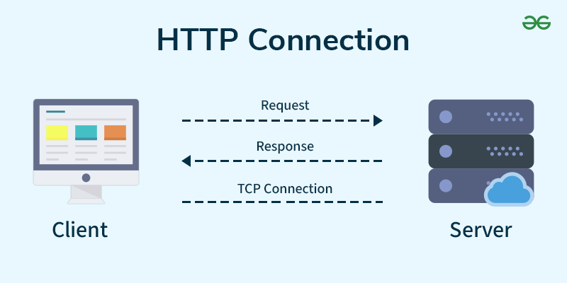

# **😇 HTTP란 무엇인가?**

## HTTP의 정의와 역할

HTTP(HyperText Transfer Protocol)는 클라이언트(예: 웹 브라우저)와 서버 간에 데이터를 주고받기 위한 프로토콜임.

- 주로 HTML, 이미지, 동영상 등 웹 콘텐츠를 전송하는 데 사용됨.
- **요청(Request)**: 클라이언트가 서버에 데이터나 작업을 요청.
- **응답(Response)**: 서버가 요청에 대한 결과나 데이터를 전달.

HTTP는 **Stateless(상태 비저장)** 프로토콜로, 각 요청은 독립적으로 처리되며 이전 요청의 정보를 기억하지 않음.

## 인터넷에서 HTTP의 중요성

- **웹의 기반 기술:**
  HTTP는 웹 브라우저와 서버 간의 통신을 가능하게 해주는 인터넷의 핵심 프로토콜임.
- **유연성과 확장성:**
  다양한 데이터 형식과 요청 방식을 지원하며, REST API와 같은 최신 웹 서비스에도 사용됨.
- **표준화:**
  전 세계적으로 동일한 방식으로 동작하므로, 다양한 플랫폼에서 호환 가능.
- **진화:**
  보안성을 높인 HTTPS로 발전하며, 더 빠르고 안전한 인터넷 환경을 제공.

HTTP는 인터넷이 작동하는 근본적인 방식 중 하나로, 웹을 탐색하고 서비스를 이용하는 데 없어서는 안 될 중요한 기술임.

# **🥳 HTTP의 작동 원리**

## 요청(Request)과 응답(Response) 구조

HTTP는 클라이언트와 서버 간 **요청(Request)**과 **응답(Response)**을 주고받는 방식으로 동작함.

- **클라이언트:** 웹 브라우저, 앱 등 요청을 보내는 주체.
- **서버:** 클라이언트 요청을 처리하고 응답을 반환하는 주체.

### **1. 요청(Request)의 구조**

HTTP 요청은 클라이언트가 서버에 보내는 메시지로, 아래 구성 요소로 이루어짐:

1. **요청 줄(Request Line):**

   - 요청 메서드 (예: GET, POST)
   - 요청 대상 URL
   - HTTP 버전 (예: HTTP/1.1)

   예: `GET /index.html HTTP/1.1`

2. **헤더(Header):**
   - 요청에 대한 추가 정보 제공.
   - 예: `Content-Type`, `Authorization`, `User-Agent`.
3. **본문(Body):**
   - 주로 POST, PUT, PATCH 요청에 사용.
   - 클라이언트가 서버로 전송할 데이터 포함 (예: JSON, XML).

---

### **2. 응답(Response)의 구조**

서버가 클라이언트 요청에 대해 보내는 메시지로, 아래 구성 요소 포함:

1. **상태 줄(Status Line):**

   - HTTP 버전 (예: HTTP/1.1)
   - 상태 코드 (예: 200, 404)
   - 상태 메시지 (예: OK, Not Found)

   예: `HTTP/1.1 200 OK`

2. **헤더(Header):**
   - 응답에 대한 추가 정보 제공.
   - 예: `Content-Type`, `Content-Length`.
3. **본문(Body):**
   - 요청된 리소스나 결과 데이터 포함 (예: HTML, JSON).

## 주요 HTTP 메서드 (GET, POST 등)

### **1. 기본 메서드**

- **GET:** 리소스 요청 (읽기 전용).
- **POST:** 서버에 데이터 전송 (주로 생성 작업).
- **PUT:** 리소스를 생성하거나 대체.
- **DELETE:** 리소스 삭제.
- **PATCH:** 리소스 일부를 수정.
  - PUT은 전체 리소스 교체, PATCH는 일부 변경.

### **2. 추가 메서드**

- **HEAD:** GET과 유사하지만 본문 없이 헤더 정보만 반환.
- **OPTIONS:** 서버가 지원하는 메서드와 옵션 조회.

## HTTP에서 자주 사용하는 헤더와 정보

### **1. 요청(Request) 헤더**

클라이언트가 서버에 요청을 보낼 때 추가 정보를 포함하는 헤더.

1. **Host**
   - 요청 대상 서버의 호스트 이름과 포트.
   - 예: `Host: www.example.com`
2. **User-Agent**
   - 클라이언트(브라우저, 앱 등)의 정보 제공.
   - 예: `User-Agent: Mozilla/5.0 (Windows NT 10.0; Win64; x64)`
3. **Accept**
   - 클라이언트가 원하는 응답 데이터의 MIME 타입 지정.
   - 예: `Accept: text/html, application/json`
4. **Accept-Encoding**
   - 클라이언트가 지원하는 데이터 압축 방식 지정.
   - 예: `Accept-Encoding: gzip, deflate`
5. **Content-Type**
   - 요청 본문의 데이터 형식 지정 (POST, PUT 등에서 사용).
   - 예: `Content-Type: application/json`
6. **Authorization**
   - 인증 정보 전달 (주로 API 키, 토큰).
   - 예: `Authorization: Bearer <token>`
7. **Cookie**
   - 클라이언트의 쿠키 데이터 전송.
   - 예: `Cookie: session_id=abcd1234`

---

### **2. 응답(Response) 헤더**

서버가 클라이언트에 응답할 때 추가 정보를 포함하는 헤더.

1. **Content-Type**
   - 응답 본문의 데이터 형식 지정.
   - 예: `Content-Type: text/html; charset=UTF-8`
2. **Content-Length**
   - 응답 본문의 길이(바이트 단위).
   - 예: `Content-Length: 1234`
3. **Server**
   - 서버의 소프트웨어 정보 제공.
   - 예: `Server: Apache/2.4.41 (Ubuntu)`
4. **Set-Cookie**
   - 클라이언트에 저장할 쿠키를 설정.
   - 예: `Set-Cookie: session_id=abcd1234; Path=/; HttpOnly`
5. **Cache-Control**
   - 캐싱 정책 설정.
   - 예: `Cache-Control: no-cache, no-store, must-revalidate`
6. **Location**
   - 리다이렉션 시 새로운 URL 제공.
   - 예: `Location: https://www.example.com`
7. **Content-Encoding**
   - 응답 데이터의 압축 방식 지정.
   - 예: `Content-Encoding: gzip`

---

### **3. 공통적으로 사용되는 헤더**

1. **Connection**
   - 연결 관리 방식 (예: keep-alive, close).
   - 예: `Connection: keep-alive`
2. **Accept-Language**
   - 클라이언트가 선호하는 언어 설정.
   - 예: `Accept-Language: en-US, ko-KR`
3. **Referer**
   - 요청을 보낸 페이지의 URL 정보.
   - 예: `Referer: https://www.example.com`
4. **ETag**
   - 리소스의 고유 식별자 제공 (캐싱, 조건부 요청에 사용).
   - 예: `ETag: "abc123"`

# **🤡 HTTP 버전의 발전**

HTTP는 1990년대 초반부터 시작된 웹 프로토콜로, 기술 발전에 따라 다양한 버전으로 개선되어 왔음. 각 버전은 성능, 보안, 효율성을 개선하기 위해 설계됨.

---

### **1. HTTP/1.0**

- **출시:** 1996년
- **특징:**
  - 클라이언트 요청마다 새로운 연결 생성 (Connectionless).
  - 헤더와 응답 본문 포함.
  - 캐싱, 상태 코드 등 초보적인 기능 도입.
- **단점:**
  - 연결마다 리소스 소모 큼.
  - 여러 요청을 처리할 때 비효율적.

---

### **2. HTTP/1.1**

- **출시:** 1997년
- **특징:**
  - **Persistent Connection:** 여러 요청/응답에 하나의 연결 유지.
  - **파이프라이닝:** 여러 요청을 병렬로 처리 가능.
  - **Host 헤더:** 가상 호스팅 지원.
  - **캐싱 개선:** 효율적인 데이터 요청/저장.
- **단점:**
  - 대역폭과 리소스 소모 여전히 많음.
  - 많은 요청 시 병목현상 발생 (Head-of-line Blocking).

---

### **3. HTTP/2**

- **출시:** 2015년
- **특징:**
  - **멀티플렉싱:** 단일 연결에서 여러 요청/응답 동시 처리.
  - **헤더 압축:** 데이터 전송 크기 감소.
  - **서버 푸시:** 서버가 클라이언트 요청 없이도 데이터 전송 가능.
  - **TLS 권장:** HTTPS 중심으로 설계.
- **장점:**
  - 속도와 효율성 크게 개선.
  - 페이지 로딩 시간 단축.

---

### **4. HTTP/3**

- **출시:** 2022년 (표준화)
- **특징:**
  - **QUIC 프로토콜:** UDP 기반으로 연결 성능 대폭 개선.
  - **제로 라운드 트립 타임(0-RTT):** 빠른 연결 설정.
  - **멀티플렉싱 강화:** 단일 요청 실패가 전체 연결에 영향을 주지 않음.
  - **보안 내장:** TLS 1.3을 기본 포함.
- **장점:**
  - 연결 지연 최소화.
  - 안정성과 보안 강화.

---

### **HTTP 버전 비교 요약**

| **버전** | **출시** | **주요 특징**                           | **단점**                   |
| -------- | -------- | --------------------------------------- | -------------------------- |
| HTTP/1.0 | 1996     | 요청마다 새 연결 생성, 초기 단계        | 연결 재사용 불가, 비효율적 |
| HTTP/1.1 | 1997     | 지속 연결, 파이프라이닝, Host 헤더      | 병목현상, 대역폭 소모      |
| HTTP/2   | 2015     | 멀티플렉싱, 헤더 압축, 서버 푸시        | 구현 복잡, QUIC 필요       |
| HTTP/3   | 2022     | QUIC 기반, 빠른 연결, TLS 1.3 기본 제공 | UDP 의존, 초기 지원 한정적 |

# **HTTP 상태 코드**

## 주요 상태 코드 (2xx, 4xx, 5xx 등)

HTTP 상태 코드는 클라이언트의 요청에 대한 서버의 응답 상태를 나타냄. 각 코드의 첫 번째 숫자는 응답의 범주를 의미함.

---

### **1. 2xx (성공)**

클라이언트 요청이 성공적으로 처리됨.

- **200 OK**: 요청 성공, 일반적인 성공 응답.
- **201 Created**: 요청에 따라 새로운 리소스가 생성됨.
- **204 No Content**: 요청 성공, 하지만 응답 본문 없음.

---

### **2. 3xx (리다이렉션)**

클라이언트가 요청한 리소스의 위치가 변경되었거나 다른 리소스를 참조해야 함.

- **301 Moved Permanently**: 요청한 리소스가 영구적으로 다른 URL로 이동함.
- **302 Found**: 요청한 리소스가 임시적으로 다른 URL로 이동함.
- **304 Not Modified**: 클라이언트 캐시된 리소스가 최신 상태임.

---

### **3. 4xx (클라이언트 오류)**

클라이언트 요청에 오류가 있음.

- **400 Bad Request**: 잘못된 요청, 서버가 이해하지 못함.
- **401 Unauthorized**: 인증 필요, 인증 정보가 없거나 잘못됨.
- **403 Forbidden**: 클라이언트가 요청할 권한 없음.
- **404 Not Found**: 요청한 리소스를 찾을 수 없음.

---

### **4. 5xx (서버 오류)**

서버가 요청을 처리하지 못함.

- **500 Internal Server Error**: 서버 내부에서 처리 중 문제가 발생함.
- **502 Bad Gateway**: 게이트웨이나 프록시 서버가 잘못된 응답을 수신함.
- **503 Service Unavailable**: 서버가 현재 요청을 처리할 수 없음 (과부하, 유지보수).
- **504 Gateway Timeout**: 게이트웨이나 프록시 서버에서 응답 시간이 초과됨.

# **🤗 결론**

## HTTP의 한계와 HTTPS로의 전환

### **HTTP의 한계**

1. **보안 부족:**
   - HTTP는 데이터를 암호화하지 않아 평문으로 전송됨.
   - 도청, 중간자 공격(Man-in-the-Middle Attack)에 취약함.
2. **인증 부재:**
   - 서버의 신원을 검증하지 않아 피싱 사이트 위험 존재.
3. **데이터 무결성:**
   - 전송 중 데이터가 변경될 경우 이를 탐지하지 못함.

### **HTTPS로의 전환**

- **HTTPS의 도입:**
  HTTPS는 SSL/TLS를 활용해 보안성을 제공하며, HTTP의 주요 한계를 해결.
  - 데이터 암호화로 기밀성 보장.
  - 인증서를 통해 신뢰성 확보.
  - 데이터 무결성 유지.
- **현재 트렌드:**
  - 브라우저와 검색 엔진(예: Google)은 HTTPS를 기본 요구 사항으로 권장.
  - HTTPS가 아닌 사이트는 "안전하지 않음" 경고 표시.
  - SEO에서 HTTPS가 순위에 긍정적 영향을 미침.

## HTTP의 미래

- **HTTP/3 도입:**
  - 최신 프로토콜로 **QUIC(Quick UDP Internet Connections)** 기반.
  - 더 빠르고 안정적인 연결 제공.
  - 연결 지연 줄이고 데이터 전송 최적화.
- **보안 표준 강화:**
  - HTTPS가 디폴트가 되며, HTTP는 테스트 및 비중요 작업에서만 사용.
  - 강력한 암호화와 인증 기술 발전.
- **IoT와 경량 HTTP 프로토콜:**
  - 리소스가 제한된 IoT 환경에서 HTTP를 경량화한 프로토콜로 변형해 사용.
- **양자 암호화 대응:**
  - 양자 컴퓨터의 발전으로 기존 암호화가 깨질 위험 대비, 양자 안전 암호화 기술 개발.

## QUIC란?

- \*QUIC(Quick UDP Internet Connections)\*\*는 Google이 개발한 전송 계층 프로토콜입니다.
- **UDP** 기반으로 설계되었으며, TCP의 문제점을 개선하기 위해 만들어졌습니다.
- 주요 특징:
  - **빠른 연결 설정:** 전송 계층에서 0-RTT(제로 라운드 트립 타임)로 연결 지연 최소화.
  - **멀티플렉싱:** 한 연결 내에서 여러 스트림을 병렬로 처리 (HTTP/2의 Head-of-Line Blocking 문제 해결).
  - **TLS 1.3 내장:** 보안이 기본적으로 포함된 전송 계층.

### **QUIC와 HTTP/3의 차이**

| **특징**      | **QUIC**                          | **HTTP/3**                                    |
| ------------- | --------------------------------- | --------------------------------------------- |
| **역할**      | 전송 계층 프로토콜 (TCP 대체)     | 애플리케이션 계층 프로토콜 (HTTP의 최신 버전) |
| **기반 기술** | UDP                               | QUIC 위에서 동작                              |
| **목적**      | 데이터 전송의 빠른 연결 및 안정성 | 웹 요청/응답을 더 빠르고 효율적으로 처리      |
| **보안**      | TLS 1.3 내장                      | QUIC의 보안을 활용                            |
| **사용 사례** | HTTP/3, 스트리밍, 실시간 통신 등  | 웹 브라우저와 서버 간 통신 (HTTP 요청/응답)   |
