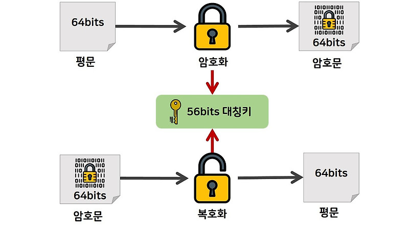
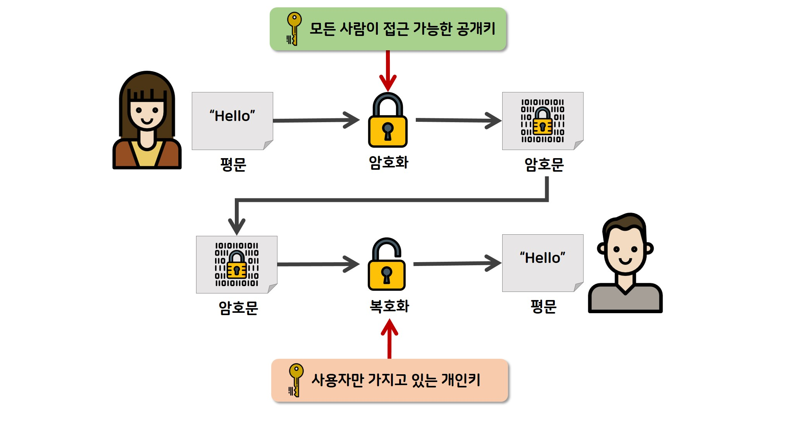

# **🙃 암호화의 기초!**

## 암호화란 무엇인가?

> 암호화는 데이터를 보호하기 위해 평문을 암호문으로 바꾸는 기술임. 누구나 못 보고, 정해진 키 있어야만 복호화 가능함.

### 암호화 목적

- **기밀성:** 허락받은 사람만 데이터 볼 수 있음.
- **무결성:** 데이터가 중간에 변조 안 됨.
- **인증:** 누가 보냈는지 확인 가능.

### 구성 요소

- **알고리즘:** 암호화하는 방식. 예: AES, RSA.
- **키:** 암호화/복호화에 필요한 비밀 값.
  - 대칭키: 같은 키 사용.
  - 비대칭키: 공개키와 개인키 따로 사용.

데이터 보호와 안전한 통신에 꼭 필요한 기술임.

## 대칭키와 비대칭키의 개념

### 대칭키 암호화

- 하나의 키로 암호화/복호화 다 함.
- 속도 빠름.
- 키 노출되면 위험함.
- 예: AES, DES.

### 비대칭키 암호화

- 공개키(암호화)와 개인키(복호화) 따로 씀.
- 속도 느림.
- 키 노출 위험 적음.
- 예: RSA, ECC.

대칭키는 빠르고 효율적, 비대칭키는 보안성 높음. 상황 따라 적절히 사용해야 함.

# **😝 대칭키 암호화!**

## 대칭키 암호화란?

- 암호화랑 복호화에 같은 키 씀.
- 빠르고 효율적임.
- 키 노출되면 보안 뚫림.
- 주로 파일 암호화, 네트워크 통신에 쓰임.

단점: 키 공유 어려움, 키 관리 복잡함.

## 주요 대칭키 암호화 알고리즘

### AES (Advanced Encryption Standard)

- 현재 가장 많이 쓰임.
- 속도 빠르고 보안 강함.
- 블록 크기 128비트, 키 길이 128/192/256비트 지원.

### DES (Data Encryption Standard)

- 옛날 알고리즘.
- 보안 취약해서 잘 안 씀.
- 블록 크기 64비트, 키 길이 56비트.

### 3DES (Triple DES)

- DES를 세 번 적용함.
- DES보다 보안 강하지만 속도 느림.
- 블록 크기 64비트, 키 길이 최대 168비트.

## 장점과 단점

### 장점

- **속도 빠름:** 대용량 데이터 암호화에 유리함.
- **구현 쉬움:** 알고리즘 간단함.

### 단점

- **키 공유 문제:** 키 안전하게 전달 어려움.
- **키 관리 복잡:** 통신 상대마다 별도 키 필요함.
- **보안성 한계:** 키 노출되면 데이터 위험.

# **😧 비대칭키 암호화!**

## 비대칭키 암호화란?

- 공개키랑 개인키 두 개 씀.
  - **공개키:** 암호화에 사용, 누구나 볼 수 있음.
  - **개인키:** 복호화에 사용, 소유자만 가짐.
- 한쪽 키로 암호화하면 다른 쪽 키로만 복호화 가능.
- 보안 강하지만 속도 느림.
- 주로 인증, 디지털 서명, 키 교환에 사용.
- 알고리즘: RSA, ECC, DSA.

비대칭키는 보안 강화에 유리하지만 연산량 많아서 대칭키랑 같이 쓰는 경우 많음. (예: 하이브리드 암호화)

## 주요 비대칭키 암호화 알고리즘

### RSA (Rivest-Shamir-Adleman)

- 가장 오래되고 많이 쓰임.
- 큰 소수를 곱해 만든 키로 암호화/복호화함.
- 키 길이 길수록 보안 강하지만 속도 느려짐.
- 주로 데이터 암호화, 디지털 서명에 사용.

### ECC (Elliptic Curve Cryptography)

- 타원 곡선 수학 기반 알고리즘.
- RSA보다 짧은 키로 같은 수준의 보안 제공.
- 속도 빠르고 리소스 적게 씀.
- 모바일, IoT 같은 환경에 적합.

### DSA (Digital Signature Algorithm)

- 디지털 서명에 특화된 알고리즘.
- 데이터 무결성과 인증 보장.
- RSA보다 서명 생성은 빠르지만 검증은 느림.

비대칭키 알고리즘은 각자 장단점이 있어서 목적과 환경에 따라 적절히 선택해야 함.

## 장점과 단점

### 장점

- **보안성 높음:** 공개키랑 개인키 따로 써서 키 노출 위험 적음.
- **키 관리 용이:** 공개키는 자유롭게 공유 가능, 개인키만 안전하게 보관하면 됨.
- **인증 가능:** 디지털 서명으로 데이터 송신자 확인 가능.
- **대칭키 전달 문제 해결:** 안전하게 대칭키 교환 가능 (예: RSA로 키 암호화).

### 단점

- **속도 느림:** 대칭키보다 연산 복잡해서 대용량 데이터 처리에 부적합.
- **리소스 많이 사용:** CPU, 메모리 등 자원 소모 큼.
- **복잡성 증가:** 구현 및 유지보수가 대칭키보다 어려움.

비대칭키는 보안 강화와 키 관리에 유리하지만, 효율성은 떨어짐. 대칭키랑 같이 쓰는 하이브리드 방식이 일반적임.

# **🥸 대칭키와 비대칭키의 비교!**

## 키 사용 방식의 차이

- **대칭키**
  하나의 키로 암호화와 복호화 둘 다 함.
  키 공유가 필수적이라 전송 중 노출 위험 있음.
- **비대칭키**
  공개키와 개인키 두 개 사용.
  공개키로 암호화, 개인키로 복호화 (혹은 반대로).
  키 공유 문제 해결 가능.

## 속도와 보안성 비교

- **속도**
  - 대칭키 > 비대칭키 (대칭키가 훨씬 빠름).
  - 비대칭키는 연산 복잡해서 느림.
- **보안성**
  - 대칭키는 키 노출되면 취약함.
  - 비대칭키는 공개키와 개인키 분리로 더 안전함.

## 사용 사례의 차이

- **대칭키**
  - 파일 암호화, 데이터베이스 암호화.
  - VPN, SSL/TLS에서 데이터 암호화.
- **비대칭키**
  - 디지털 서명, 인증서 기반 통신.
  - 키 교환 (예: 대칭키 전달).

# **😇 결론**

## 대칭키와 비대칭키의 조합 (하이브리드 암호화)

- 대칭키와 비대칭키를 함께 사용해 각 방식의 장단점을 보완함.
- **작동 방식:**
  1. 비대칭키로 대칭키를 안전하게 전달.
  2. 전달받은 대칭키로 데이터를 빠르게 암호화/복호화.
- **예:**
  - HTTPS/TLS: 대칭키로 데이터 암호화, 비대칭키로 키 교환.
  - PGP: 파일 암호화에 대칭키 사용, 키 교환에 비대칭키 사용.

### **장점**

- 대칭키의 속도 + 비대칭키의 보안성 결합.
- 대량 데이터도 안전하게 처리 가능.

### 단점

- **복잡성 증가**
  - 두 암호화 방식 관리로 시스템 설계 어려움.
- **속도 병목**
  - 비대칭키로 키 교환 시 속도 느림.
- **키 관리 부담**
  - 대칭키와 비대칭키 모두 안전하게 관리해야 함.

## 암호화 기술의 현재와 미래

- **현재:**
  - 대칭키와 비대칭키 혼합 사용이 표준 (예: TLS, VPN).
  - RSA와 ECC 기반 비대칭키, AES 기반 대칭키가 주류.
  - 디지털 서명, 인증서 등으로 신뢰 구축.
- **미래:**
  - **양자 암호화:** 양자컴퓨터에 대응하는 새로운 암호 알고리즘 필요.
  - **경량 암호화:** IoT 기기와 같은 리소스 제한 환경에 적합한 암호 기술 발전.
  - **제로 트러스트 모델:** 암호화 기반 보안으로 네트워크 전반에서 신뢰하지 않는 환경 구축.
