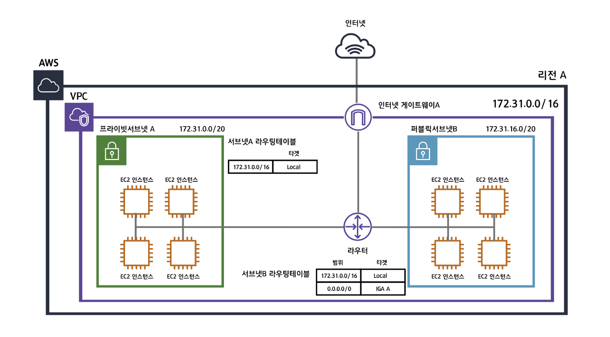

## 1. AWS란?

### 1.1 AWS의 개요와 역사

- **AWS(Amazon Web Services)**란 **아마존(Amazon)**에서 제공하는 **클라우드 컴퓨팅 서비스**입니다.
    - 물리 서버, 스토리지, 네트워크, 데이터베이스, 분석, 머신러닝 등 **IT 인프라 전반**을 서비스 형태로 제공합니다.
- **출시 배경**:
    - 아마존 내부에서 효율적인 인프라를 구축·운영하다가, 이를 외부 고객에게도 제공하기 시작했습니다.
    - 2006년 **EC2**(Elastic Compute Cloud)와 **S3**(Simple Storage Service)를 발표하면서 본격적인 **퍼블릭 클라우드 시대**가 열렸습니다.
- **현재**:
    - 전 세계적으로 **200개 이상의 서비스**를 제공하고 있으며, 클라우드 시장 점유율 1위(경쟁사: Microsoft Azure, Google Cloud 등)를 차지하고 있습니다.
    - **글로벌 인프라**(Region, Availability Zone)를 통해 전 세계 어디서든 낮은 지연 시간과 확장성을 보장합니다.

### AWS 역사 간단 타임라인

| 연도 | 이벤트 |
| --- | --- |
| 2006 | EC2, S3 정식 출시 |
| 2009 | VPC(Virtual Private Cloud) 서비스 출시 |
| 2012 | AWS Marketplace 오픈 |
| 2014 | Lambda, IoT 등 신규 서버리스·IoT 서비스 출시 |
| 2019 | Outposts, EKS 등 컨테이너·하이브리드 서비스 확대 |
| 현재 | 200+ 서비스 제공, 글로벌 30+ 리전(Region) 운영 중 |

### 1.2 클라우드 컴퓨팅 시대에서 AWS의 역할

- **온디맨드(On-demand) 인프라**: 물리 서버 구매 없이, 필요한 순간에 필요한 만큼 인프라를 활용.
- **글로벌 확장**: 전 세계 곳곳에 데이터 센터(Region/AZ)가 있어서 지리적으로 **가깝게** 서버를 배치 가능.
- **비용 효율성과 탄력성**: 사용량에 따라 지불하는 종량제 모델이 기본. 불필요한 리소스는 쉽게 중지/삭제하여 **비용 최적화** 가능.
- **다양한 고급 서비스 제공**: AI/ML, 빅데이터, IoT, 분석, 보안 등 최신 기술을 **관리형 서비스**로 신속하게 도입할 수 있음.

---

## 2. EC2란?

### 2.1 EC2의 개념과 주요 특징

- **EC2(Elastic Compute Cloud)**:
    - AWS의 **가상 머신(VM) 서비스**로, 사용자가 원하는 사양(CPU, 메모리, 네트워크)으로 서버를 생성할 수 있는 핵심 컴퓨팅 서비스입니다.
- **주요 특징**:
    1. **탄력성**: 사용자가 필요할 때 빠르게 인스턴스(서버)를 추가/제거함으로써 트래픽 변동에 유연하게 대응.
    2. **다양한 인스턴스 유형**: 일반 범용형부터 GPU 기반 고성능 연산용까지 여러 타입이 존재.
    3. **안정성**: 여러 Availability Zone(AZ)에 걸쳐 인스턴스를 배치해 **고가용성(HA)** 아키텍처를 구축할 수 있음.
    4. **통합성**: IAM, VPC, S3, EBS 등 AWS 내 다른 서비스와 **긴밀하게 연동**되어 관리가 편리함.

### 2.2 EC2 활용 사례 및 장점

- **활용 사례**:
    - 웹 서버, 애플리케이션 서버, 데이터베이스 서버(일부 케이스) 등 **다양한 서버 워크로드**.
    - 실험적인 개발/테스트 환경(테스트 후 서버를 껐다가 다시 켜거나 삭제 가능).
    - GPU/고성능 서버를 활용한 **AI/머신러닝 모델 학습**, 3D 렌더링 작업 등.
- **장점**:
    - **신속한 배포**: 몇 분 안에 서버가 준비되므로 프로젝트 아이디어를 빠르게 실험 가능.
    - **유연한 확장**: Auto Scaling, Load Balancer와 결합해 자동 증설/축소 가능.
    - **비용 효율적**: 온디맨드 기반으로 필요한 시점만 사용하고, 예약 인스턴스나 스팟 인스턴스로 비용 추가 절감 가능.

### 2.3 EC2 아키텍처와 구성 요소

**🖐️2.3.1 기본 구조와 네트워킹**

- **보안 그룹(Security Group)**:
    - 인스턴스 수준의 **가상 방화벽**.
    - 허용 트래픽(포트/프로토콜/IP 범위)을 정의하고, 그 외 트래픽은 차단.
    - **상태 저장(Stateful)** 방식이라 인바운드가 허용되면 자동으로 아웃바운드 트래픽도 허용.
- **키 페어(Key Pair)**:
    - EC2 인스턴스에 **SSH**로 접근하기 위해 사용하는 **퍼블릭/프라이빗 키** 쌍.
    - AWS 콘솔에서 생성하거나 기존 키를 업로드하여 사용할 수 있음.

**🖐️2.3.2 인스턴스 유형 및 선택 기준**

- **범용(General Purpose)**: CPU/메모리가 균형 잡힌 t계열(t2, t3, t4g), m계열(m5, m6g 등).
- **컴퓨팅 최적화(Compute Optimized)**: CPU 집약적 워크로드(c5, c6g).
- **메모리 최적화(Memory Optimized)**: 대용량 인메모리 DB, 캐시 서버(r5, r6g, x1).
- **가속화(Accelerated Computing)**: GPU/FPGA 기반(p3, g4, f1)으로 머신러닝, 그래픽, 암호화 계산 등에 적합.

> 실무 팁: 인스턴스는 워크로드에 따라 선택하고, 테스트 후 모니터링을 통해 다운사이징(작은 타입 변경)이나 업사이징(큰 타입 변경)을 유연하게 진행하세요.
> 

---

## 3. AWS 네트워킹 기본 – VPC와 탄력적 IP

### 3.1 VPC의 개념 및 구성요소

- **VPC(Virtual Private Cloud)**:
    - 논리적으로 격리된 **가상 네트워크** 공간.
    - 각 사용자(혹은 조직)마다 전용 네트워크 세그먼트를 구성할 수 있어 **보안**과 **확장성**을 제공.
- **구성요소**:
    1. **서브넷(Subnet)**: VPC를 더 작은 IP 범위로 나눈 것. **퍼블릭 서브넷**(인터넷 게이트웨이 연결), **프라이빗 서브넷**(내부 리소스) 등으로 나눠서 사용.
    2. **라우팅 테이블(Routing Table)**: 서브넷 내 트래픽이 어디로 가야 하는지 정의(예: 인터넷은 IGW로, 내부 통신은 VPC 내부로).
    3. **인터넷 게이트웨이(IGW)**: 퍼블릭 서브넷과 **인터넷**을 연결해주는 관문.
    4. **NAT 게이트웨이(NAT Gateway)**: 프라이빗 서브넷 리소스가 **인터넷에 나갈 때** 사용하는 출구 역할(들어오는 트래픽은 차단).
    
    
    

### 3.2 탄력적 IP(Elastic IP)의 필요성과 관리 방법

- **탄력적 IP(EIP)**:
    - 바뀌지 않는 **고정 공인 IP** 주소를 AWS가 제공.
    - EC2 인스턴스를 재시작해도 IP가 바뀌지 않아 **DNS** 등에 등록하여 안정적으로 사용할 수 있음.
- **관리 포인트**:
    - **EIP는 유한 자원**이므로 불필요한 할당을 지양해야 하며, 연결되지 않은 EIP에는 비용이 발생.
    - 인스턴스를 중지한 뒤 다른 인스턴스에 재할당 가능 -> **유연한 IP 관리** 가능.

---

## 4. 스토리지 서비스 – EBS

### 4.1 EBS의 역할 및 스토리지 유형

- **EBS(Elastic Block Store)**:
    - **EC2 인스턴스**에 연결하여 사용할 수 있는 **블록 스토리지**.
    - 물리 서버의 HDD/SSD와 유사하게, OS에서 디스크로 인식됩니다.
- **스토리지 유형**:
    1. **General Purpose SSD(gp2/gp3)**:
        - 웹 서버나 일반 DB에 적합한 범용 SSD.
        - gp3는 IOPS와 처리량(Throughput)을 독립적으로 조정 가능.
    2. **Provisioned IOPS SSD(io1/io2)**:
        - IOPS가 중요한 대규모 트랜잭션 DB(OLTP) 등에서 활용.
        - 높은 성능을 위해 사전에 IOPS를 지정해두고 사용할 수 있음.
    3. **Throughput Optimized HDD(st1)**, **Cold HDD(sc1)**:
        - 대용량 순차 읽기/쓰기 작업(로그, 빅데이터) 용도.
        - 랜덤 I/O보다는 **순차 처리량**이 중요한 환경에 적합.

### 4.2 성능, 백업 및 관리 전략

- **성능 관리**:
    - EC2 모니터링(CPU, I/O 스텟)을 통해 **디스크 병목**이 있는지 체크.
    - IOPS가 부족하면 **io2** 혹은 **gp3**로 전환하여 성능 보완.
- **백업**:
    - **스냅샷(Snapshot)** 기능을 사용해 EBS 볼륨의 특정 시점을 백업 가능.
    - 스냅샷은 증분 백업이라 용량 부담을 줄이고, 다른 리전으로도 복제 가능.
- **운영 관리**:
    - **디스크 확장**: 볼륨 크기를 동적으로 늘릴 수 있으며, OS 레벨에서 파일시스템 확장 명령 필요.
    - **비용 최적화**: 한 번도 사용하지 않는 EBS 볼륨을 방치하면 비용 발생 → 정기 점검이 필요.

---

## 5. 탄력적 로드 밸런싱(ELB)

### 5.1 ELB의 개념과 역할

- **ELB(Elastic Load Balancing)**:
    - 사용자 요청(트래픽)을 여러 **EC2 인스턴스** 또는 다른 타깃(Lambda, 컨테이너 등)으로 **분산**해주는 관리형 서비스.
    - 장애가 발생한 인스턴스를 **자동으로 제외**, 복구되면 다시 트래픽을 분산하여 **애플리케이션 가용성**을 높임.
- **필요성**:
    - 하나의 인스턴스에 트래픽이 몰리면 장애 가능성이 높아짐.
    - ELB를 통해 여러 서버에 트래픽을 분산하여 **부하 균형**을 유지하며, 서버 장애 시에도 서비스 중단을 최소화.

### 5.2 ELB의 종류 및 로드 밸런싱 작동 방식

1. **ALB(Application Load Balancer)**:
    - 7계층(HTTP/HTTPS) 로드 밸런싱.
    - **URL 기반 라우팅**(예: /api/ -> API 서버, /images/ -> 이미지 서버), **호스트 기반 라우팅**(도메인에 따라 타깃 그룹 분리) 지원.
    - **웹 애플리케이션**에서 가장 많이 쓰이는 유형.
2. **NLB(Network Load Balancer)**:
    - 4계층(TCP/UDP) 기반 로드 밸런싱.
    - 초당 수백만 건의 요청을 처리할 수 있는 **고성능**을 제공하며, 지연 시간도 매우 낮음.
    - 실시간 게임 서버, 고성능 네트워크 앱 등에 적합.
3. **CLB(Classic Load Balancer)**:
    - 구버전 로드 밸런서.
    - 4계층/7계층 혼합 지원하지만, ALB/NLB에 비해 기능이 제한적이어서 **신규 구축 시**는 ALB/NLB 사용을 권장.

---

## 6. 통합 아키텍처 및 운영 전략

### 6.1 EC2, VPC, EBS, 탄력적 IP, ELB의 통합 구성

- **전형적인 웹 애플리케이션 아키텍처**:
    1. VPC 내부에 **퍼블릭 서브넷**(웹 서버, ELB)과 **프라이빗 서브넷**(DB 서버) 나누기.
    2. **ELB**를 퍼블릭 서브넷에 배치해 인터넷 트래픽을 받아옴.
    3. ELB가 트래픽을 여러 **EC2 인스턴스**(각각 EBS 볼륨 연결)에 분산.
    4. **탄력적 IP**(필요 시 특정 인스턴스나 NAT 게이트웨이 할당).
    5. DB나 캐시는 보안을 위해 프라이빗 서브넷에 위치.

### 6.2 고가용성, 자동 확장, 모니터링 및 장애 대응 전략

- **고가용성(HA)**:
    - AZ(가용 영역) 2개 이상에 EC2 인스턴스를 각각 배치.
    - ELB가 **Health Check**를 통해 장애 인스턴스는 트래픽 분산 대상에서 제외.
- **자동 확장(Auto Scaling Group, ASG)**:
    - CPU 사용률, 네트워크 트래픽 등 기준으로 스케일 아웃/인 (인스턴스 증가/감소) 설정.
    - 트래픽이 급증해도 빠르게 인스턴스 수를 늘려 **서비스 안정성** 확보.
- **모니터링**:
    - **CloudWatch** 지표(CPU, Network, I/O, Status Check 등)로 자동 알람 설정.
    - 장애 전조(높은 CPU/메모리 사용 등) 포착 시 미리 대응.
- **장애 대응**:
    - **EC2 Status Check**(System/Instance) 실패 시 자동 재시작 또는 다른 인스턴스로 대체.
    - **EBS 스냅샷**과 **AMI**(Amazon Machine Image)를 활용하면 서버 복구 시점을 빠르게 단축.

---

## 7. 가격 정책과 비용 최적화 전략

### 7.1 온디맨드, 예약 인스턴스, 스팟 인스턴스 개요

1. **온디맨드(On-demand)**:
    - 시간 단위(혹은 초 단위)로 사용한 만큼 비용 지불.
    - 초기 비용(Upfront)이 없고, 짧은 기간·변동이 심한 워크로드에 적합.
2. **예약 인스턴스(Reserved Instance, RI)**:
    - 1년 혹은 3년 기간 동안 특정 인스턴스 유형을 예약.
    - **장기 사용** 시 높은 할인율(최대 75% 이상)로 비용 절감.
3. **스팟 인스턴스(Spot Instance)**:
    - AWS의 유휴 컴퓨팅 리소스를 경매 형태로 제공, **매우 저렴**.
    - 단, AWS에서 리소스가 필요하면 인스턴스가 사전 통보 후 **종료**될 수 있음 → **백업 작업, 비핵심 작업(배치 프로세스)** 등에 적합.

### 7.2 비용 관리 도구와 최적화 방법

- **AWS Cost Explorer**:
    - 각 서비스별 비용 추이 분석, 월별 예측, 태그 기반 비용 할당 등 가능.
- **AWS Budgets**:
    - 프로젝트별 예산을 설정하고, 초과 시 알람을 받는 기능.
- **Savings Plans**:
    - 컴퓨팅 전반(EC2, Fargate, Lambda)에 일정 사용량을 약정해 비용 할인.
- **최적화 방법**:
    - **RI or Savings Plans** 적용으로 장기 사용 비용 절감.
    - **스팟 인스턴스**를 백그라운드 작업에 적극 활용.
    - 미사용 EBS 볼륨·탄력적 IP·스냅샷을 정기적으로 삭제/정리.

---

## 8. 서버리스 및 컨테이너 아키텍처

### 8.1 AWS Lambda, API Gateway 등 서버리스 서비스 개요

- **서버리스(Serverless)**:
    - 서버 인프라를 직접 관리하지 않고, 이벤트 기반으로 **코드만 배포**해 실행하는 모델.
    - 인프라 관리 부담 ↓, 이벤트가 발생해야만 비용 지불(사용량 기반 과금).
- **AWS Lambda**:
    - **FaaS(Function as a Service)** 형태. 함수를 업로드하고, 이벤트(HTTP 요청, S3 업로드, DB 변경 등) 발생 시 코드가 실행.
    - 짧은 시간 실행되는 **소규모 로직**, 백엔드 API 구현 등에 활용.
- **API Gateway**:
    - RESTful, WebSocket API 엔드포인트를 손쉽게 구성하고, Lambda, EC2, 다른 AWS 서비스와 연결.
    - 인증/인가, 트래픽 관리, CORS 설정 등을 지원.

### 8.2 ECS, EKS, Fargate 등 컨테이너 서비스 및 마이크로서비스 아키텍처

- **컨테이너**:
    - 애플리케이션과 필요한 라이브러리를 하나의 패키지로 묶어, **이식성**과 **경량성**을 제공(Docker 기반).
- **ECS(Elastic Container Service)**:
    - AWS가 관리형으로 제공하는 컨테이너 오케스트레이션 서비스.
    - Docker 컨테이너 실행/확장/모니터링 등을 자동화.
- **EKS(Elastic Kubernetes Service)**:
    - 완전관리형 **Kubernetes** 서비스.
    - 쿠버네티스 API와 동일하게 동작하며, 운영 부담을 줄여주는 솔루션.
- **Fargate**:
    - EC2 인스턴스를 관리하지 않아도 **컨테이너만** 정의하면 자동으로 서버 프로비저닝.
    - **서버리스 컨테이너** 개념으로, 워크로드에 따른 확장/축소가 자동 관리.
- **마이크로서비스 아키텍처**:
    - 애플리케이션을 여러 **독립적인 서비스**로 분할. 각각을 **컨테이너**로 배포하여 장애 격리 및 독립 확장이 가능.
    - 각 서비스는 API Gateway, Service Mesh 등을 통해 통신.

---

## 9. 인프라 자동화 및 DevOps

### 9.1 AWS CloudFormation, Terraform 등을 통한 인프라 코드화

- **인프라를 코드(IaC, Infrastructure as Code)**로 관리:
    - YAML/JSON/HCL 등 **구성 스크립트**로 인프라(EC2, VPC, RDS, IAM 등) 리소스를 자동 생성/변경.
    - 버전 관리를 통해 인프라 변경 이력을 추적 가능.
- **CloudFormation**:
    - AWS 네이티브 IaC 솔루션. AWS 리소스를 YAML/JSON 템플릿으로 정의.
    - **스택(Stack)** 단위로 리소스 생성·변경·삭제를 일괄적으로 수행.
- **Terraform**:
    - HashiCorp에서 개발한 오픈소스 IaC 도구.
    - 멀티 클라우드( AWS, Azure, GCP 등 )와 온프레미스 환경까지 지원.
    - Provider 개념을 통해 다양한 인프라를 코드 한 곳에서 관리.

### 9.2 CI/CD 파이프라인 구축과 모니터링 도구 활용

- **CI/CD**(지속적 통합/배포) 파이프라인을 통해 **개발→테스트→배포** 과정을 자동화:
    1. **CodePipeline**: AWS가 제공하는 파이프라인 관리 서비스.
    2. **CodeBuild**: 소스 코드를 빌드/테스트.
    3. **CodeDeploy**: 여러 대의 EC2, Lambda, ECS 등에 애플리케이션 배포.
    4. **서드파티**: Jenkins, GitLab CI/CD 등도 AWS에서 쉽게 연동.
- **모니터링 및 로깅**:
    - **CloudWatch Logs**: 애플리케이션 로그를 중앙에서 수집·분석.
    - **CloudTrail**: AWS API 호출 기록을 추적해 **보안 감시**와 **이슈 분석**에 활용.
    - **ElasticSearch/OpenSearch**와 Kibana/OpenSearch Dashboard를 활용해 로그 시각화.

---

## 10. 고급 네트워킹 및 콘텐츠 전송

### 10.1 VPN, Direct Connect를 통한 안전한 네트워킹

- **Site-to-Site VPN**:
    - 온프레미스(사내 데이터센터)와 AWS VPC 간 **암호화 터널**을 구성해 보안 통신.
    - 인터넷을 통해 연결하므로 안정성보다 비용·편의성이 장점.
- **AWS Direct Connect**:
    - AWS와 **물리적인 전용선**으로 연결, **고대역폭**과 **안정성**이 우수.
    - 금융권, 대기업 등 **민감한 데이터**를 주고받거나, 안정적인 네트워크 품질이 필요한 경우 사용.

### 10.2 CloudFront, WAF, Shield 등 콘텐츠 전송 및 보안 서비스

- **CloudFront(CDN)**:
    - 전 세계 엣지 로케이션(Edge Location)에서 콘텐츠를 캐싱, **지연 시간**을 최소화.
    - 정적 웹 콘텐츠(이미지, JS, CSS), 동적 콘텐츠, 미디어 스트리밍 등에 활용.
- **WAF(Web Application Firewall)**:
    - HTTP/HTTPS 트래픽 필터링.
    - SQL 인젝션, XSS 등 **웹 공격**을 차단하는 룰 기반 보안 서비스.
- **AWS Shield**:
    - DDoS 공격에 대한 보호.
    - **Shield Standard**는 무료로 제공, **Shield Advanced**는 추가 비용을 내고 더 강력한 DDoS 보호.